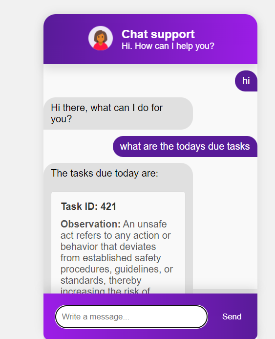
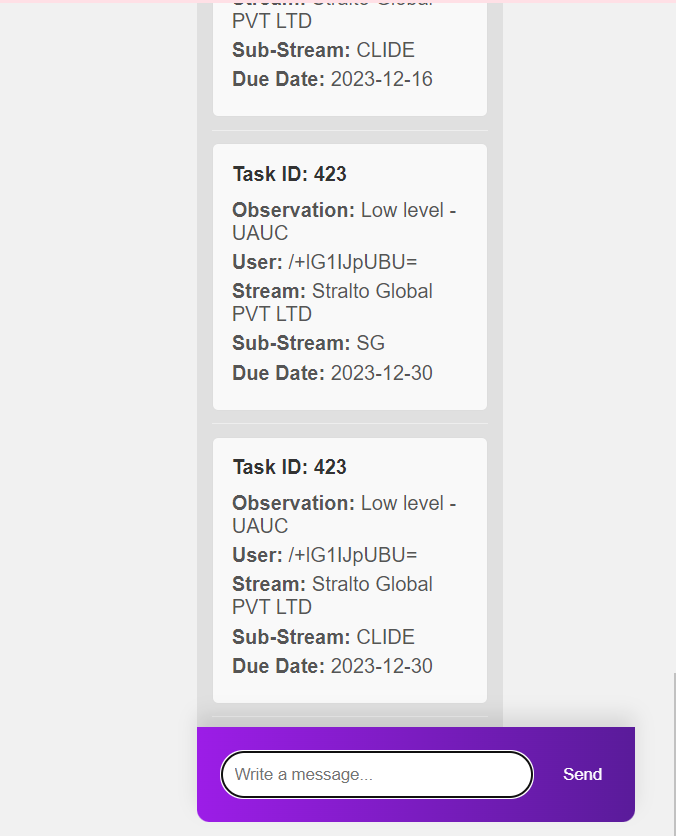
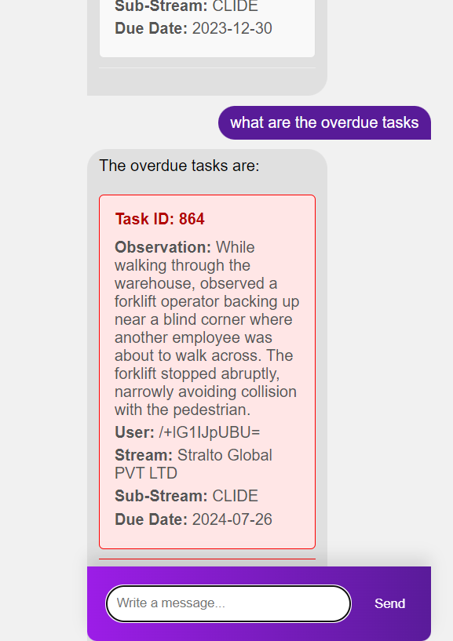
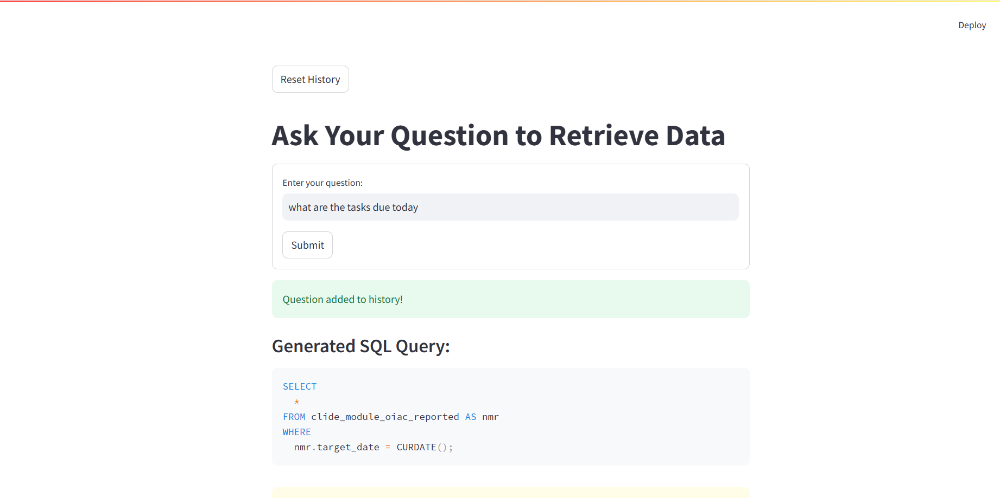
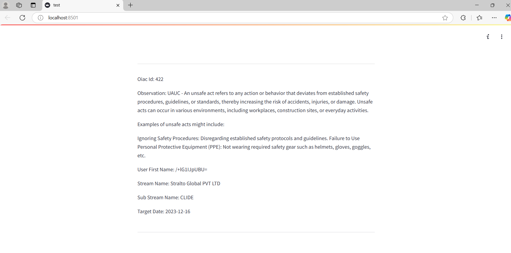
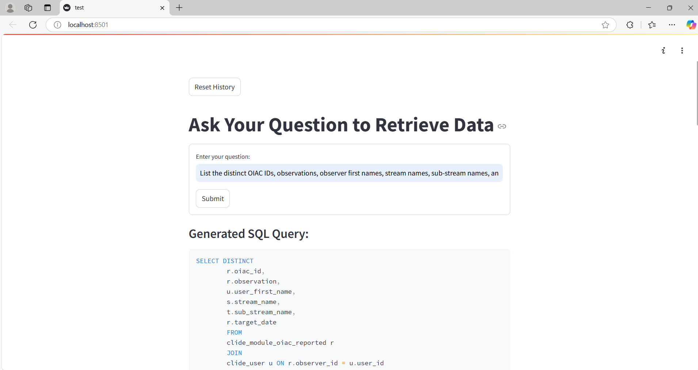
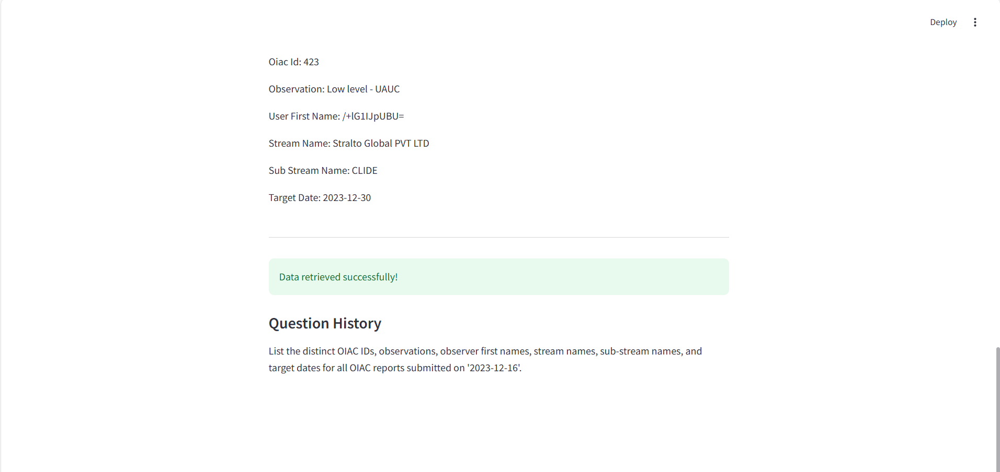

# 🧠 Natural Language SQL Generator

A Streamlit-based web app that converts natural language questions into SQL queries using Google Generative AI (Gemini), executes them on a MySQL database, and displays results in a user-friendly interface.

---

## 🚀 Features

- Natural language to SQL query generation  
- Secure MySQL database connection  
- Clean and interactive result display  
- Question history and column tracking  
- Table and column validation  

---

## 🛠️ Tech Stack

- **Backend**: Python 3, MySQL  
- **Web Framework**: Streamlit  
- **AI**: Google Generative AI (Gemini)  
- **DB Driver**: `mysql-connector-python`  

---

## 🔐 .env Setup

Create a `.env` file in the root directory with the following content:

```env
Google_api_key=YOUR_GOOGLE_API_KEY
```

---

## ⚙️ Installation

1. **Install Dependencies**

   ```bash
   pip install -r requirements.txt
   ```

2. **Add .env File**

   As shown above.

3. **Start the Streamlit App**

   ```bash
   streamlit run test.py
   ```

---

## 🗃️ MySQL Setup

Ensure you have a running MySQL server and a database created for use.  
Update the connection credentials in your project as needed.

---

## ▶️ Getting Started

Once the app is running:

1. Enter a question in natural English (e.g., _“Show all reports from March”_)  
2. The AI will:
   - Understand your question  
   - Generate the corresponding SQL  
   - Run it on your database  
   - Display results in the UI  

---

## 🧪 Example Query Flow

**User Input:**

> Show me the number of reports submitted in March.

**Generated SQL:**

```sql
SELECT COUNT(*)
FROM clide_module_near_miss_reported
WHERE MONTH(submission_date) = 3;
```

**Result:** Displayed in the Streamlit app.

---

## 📸 Screenshot










---

## Note
I am maintaining the full project in a **private repository**.  
This public repo is only a reference with **project details**

## 🙋‍♀️ Author

Developed by **Jagruti Jain**  
[LinkedIn](https://www.linkedin.com/in/jagruti-jain/) • [GitHub](https://github.com/jagrutijain109)

